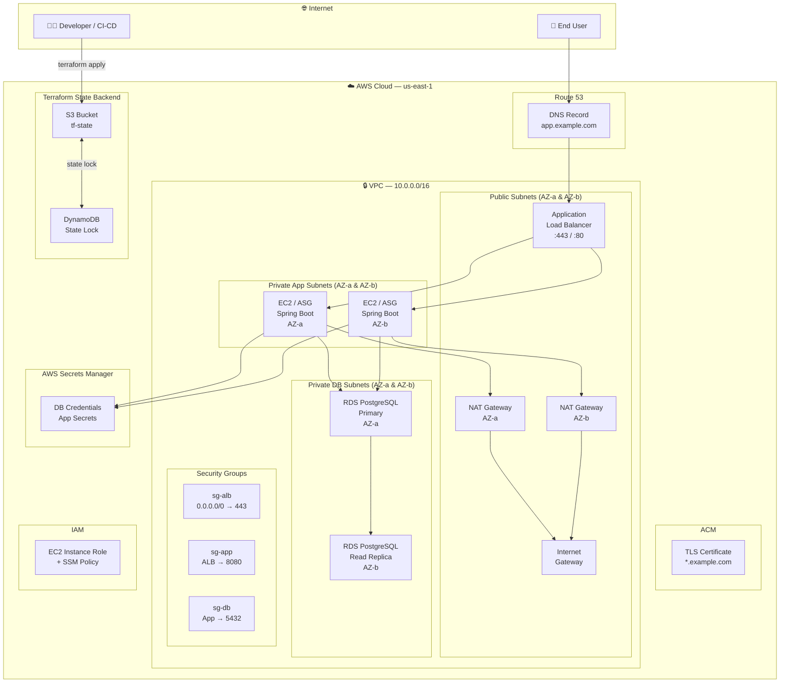
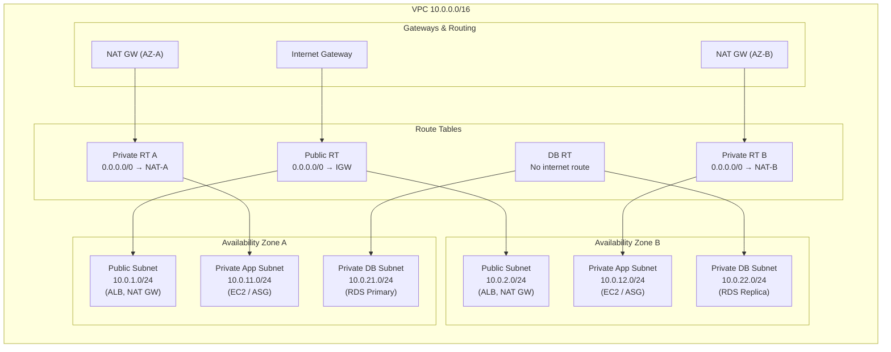
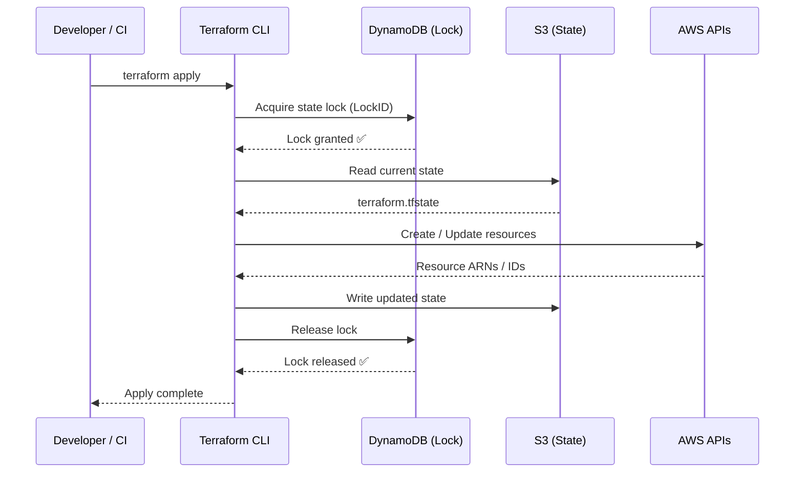
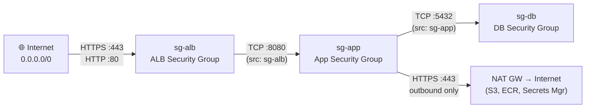
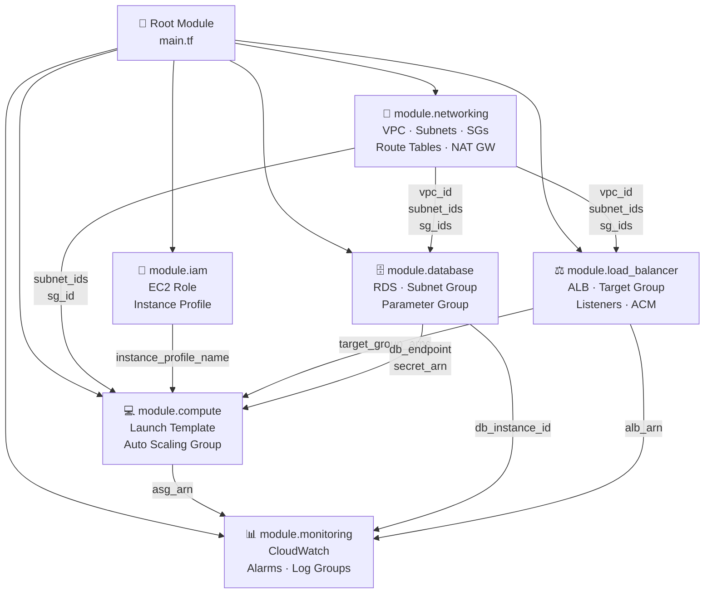
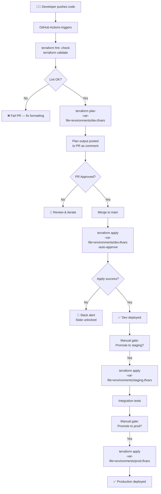
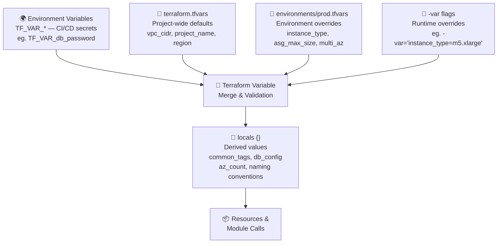

# 🏗️ Terraform Infrastructure — Spring Boot Application on AWS

> **Production-grade Infrastructure as Code** for deploying a highly available, scalable Spring Boot application on AWS. Built with advanced Terraform patterns — custom modules, dynamic parameterization, multi-tier networking, and remote state management.

---

## 📋 Table of Contents

- [Architecture Overview](#-architecture-overview)
- [Infrastructure Components](#-infrastructure-components)
- [Project Structure](#-project-structure)
- [Key Engineering Techniques](#-key-engineering-techniques)
  - [Modular Design](#1-modular-design)
  - [Dynamic Parameterization](#2-dynamic-parameterization)
  - [Advanced Networking](#3-advanced-networking)
  - [Remote State Management](#4-remote-state-management)
  - [Security & IAM](#5-security--iam)
- [Networking Deep Dive](#-networking-deep-dive)
- [Module Dependency Graph](#-module-dependency-graph)
- [Deployment Workflow](#-deployment-workflow)
- [Variable Hierarchy](#-variable-hierarchy)
- [How to Deploy](#-how-to-deploy)
- [Environment Strategy](#-environment-strategy)
- [Interviewer Highlights](#-interviewer-highlights)

---

## 🏛️ Architecture Overview

The solution deploys a **multi-tier, highly available** Spring Boot application across multiple Availability Zones, fronted by an Application Load Balancer, backed by an RDS PostgreSQL cluster, with all traffic flowing through a strictly controlled VPC network topology.



---

## 🧩 Infrastructure Components

| Component | AWS Service | Purpose |
|---|---|---|
| **Compute** | EC2 + Auto Scaling Group | Spring Boot app servers with dynamic scaling |
| **Load Balancing** | Application Load Balancer | HTTPS termination, path-based routing |
| **Database** | RDS PostgreSQL (Multi-AZ) | Persistent data store with automated failover |
| **Networking** | VPC, Subnets, Route Tables | Isolated, multi-tier network topology |
| **DNS & TLS** | Route 53 + ACM | Custom domain with managed certificates |
| **Secrets** | AWS Secrets Manager | Secure credential injection at runtime |
| **Identity** | IAM Roles & Policies | Least-privilege access for EC2 instances |
| **State** | S3 + DynamoDB | Remote state with distributed locking |
| **Monitoring** | CloudWatch + Alarms | CPU, memory, and custom app metrics |

---

## 📁 Project Structure

```
Terraform_Infra_SpringApp/
│
├── main.tf                   # Root module — wires all child modules together
├── variables.tf              # Root-level input variable declarations
├── outputs.tf                # Exposed outputs (ALB DNS, RDS endpoint, etc.)
├── terraform.tfvars          # Default variable values
├── versions.tf               # Provider + Terraform version pinning
├── backend.tf                # Remote S3 backend configuration
│
├── environments/
│   ├── dev.tfvars            # Dev environment overrides
│   ├── staging.tfvars        # Staging environment overrides
│   └── prod.tfvars           # Production environment overrides
│
└── modules/
    ├── networking/           # VPC, Subnets, IGW, NAT, Route Tables, SGs
    │   ├── main.tf
    │   ├── variables.tf
    │   └── outputs.tf
    │
    ├── compute/              # EC2 Launch Template + Auto Scaling Group
    │   ├── main.tf
    │   ├── variables.tf
    │   └── outputs.tf
    │
    ├── load_balancer/        # ALB, Target Groups, Listeners, SSL
    │   ├── main.tf
    │   ├── variables.tf
    │   └── outputs.tf
    │
    ├── database/             # RDS PostgreSQL, Subnet Groups, Parameter Groups
    │   ├── main.tf
    │   ├── variables.tf
    │   └── outputs.tf
    │
    ├── iam/                  # IAM Roles, Instance Profiles, Policies
    │   ├── main.tf
    │   ├── variables.tf
    │   └── outputs.tf
    │
    └── monitoring/           # CloudWatch Dashboards, Alarms, Log Groups
        ├── main.tf
        ├── variables.tf
        └── outputs.tf
```

---

## 🔑 Key Engineering Techniques

### 1. Modular Design

The infrastructure is composed of **independently versioned, reusable child modules**. The root `main.tf` acts purely as an orchestrator — it does not define any resources directly, only module calls.

```hcl
# main.tf — Root module wiring child modules together

module "networking" {
  source = "./modules/networking"

  vpc_cidr             = var.vpc_cidr
  availability_zones   = var.availability_zones
  public_subnet_cidrs  = var.public_subnet_cidrs
  private_subnet_cidrs = var.private_subnet_cidrs
  db_subnet_cidrs      = var.db_subnet_cidrs
  environment          = var.environment
  tags                 = local.common_tags
}

module "compute" {
  source = "./modules/compute"

  ami_id             = data.aws_ami.amazon_linux.id
  instance_type      = var.instance_type
  min_size           = var.asg_min_size
  max_size           = var.asg_max_size
  desired_capacity   = var.asg_desired_capacity
  private_subnet_ids = module.networking.private_subnet_ids
  security_group_id  = module.networking.app_sg_id
  iam_instance_profile = module.iam.instance_profile_name
  target_group_arns  = module.load_balancer.target_group_arns
  user_data          = templatefile("${path.module}/templates/user_data.sh.tpl", {
    db_endpoint = module.database.db_endpoint
    secret_arn  = module.database.secret_arn
    app_env     = var.environment
  })
  tags = local.common_tags
}

module "database" {
  source = "./modules/database"

  engine_version    = var.db_engine_version
  instance_class    = var.db_instance_class
  db_name           = var.db_name
  multi_az          = var.environment == "prod" ? true : false
  subnet_ids        = module.networking.db_subnet_ids
  security_group_id = module.networking.db_sg_id
  tags              = local.common_tags
}
```

**Why this matters:** Each module has a clean, versioned interface (inputs/outputs). Teams can work on modules independently, modules can be tested in isolation, and the same module is reused across dev/staging/prod with different `tfvars`.

---

### 2. Dynamic Parameterization

Rather than hardcoding values, the project uses **`locals`, `for_each`, `dynamic` blocks, conditional expressions, and `templatefile`** to make the configuration fully data-driven.

#### Dynamic Subnet Creation with `for_each`

```hcl
# modules/networking/main.tf

resource "aws_subnet" "public" {
  for_each = {
    for idx, cidr in var.public_subnet_cidrs :
    var.availability_zones[idx] => {
      cidr = cidr
      az   = var.availability_zones[idx]
    }
  }

  vpc_id                  = aws_vpc.main.id
  cidr_block              = each.value.cidr
  availability_zone       = each.value.az
  map_public_ip_on_launch = true

  tags = merge(var.tags, {
    Name = "${var.environment}-public-${each.key}"
    Tier = "public"
  })
}
```

#### Dynamic Security Group Rules

```hcl
resource "aws_security_group" "app" {
  name   = "${var.environment}-app-sg"
  vpc_id = aws_vpc.main.id

  dynamic "ingress" {
    for_each = var.app_ingress_rules
    content {
      from_port       = ingress.value.from_port
      to_port         = ingress.value.to_port
      protocol        = ingress.value.protocol
      security_groups = ingress.value.source_sg_ids
      description     = ingress.value.description
    }
  }

  dynamic "egress" {
    for_each = var.app_egress_rules
    content {
      from_port   = egress.value.from_port
      to_port     = egress.value.to_port
      protocol    = egress.value.protocol
      cidr_blocks = egress.value.cidr_blocks
    }
  }
}
```

#### Environment-Aware Locals

```hcl
# variables.tf / locals block

locals {
  common_tags = {
    Project     = var.project_name
    Environment = var.environment
    ManagedBy   = "Terraform"
    Owner       = var.team_owner
  }

  # Dynamically compute AZ count to match subnet lists
  az_count = length(var.availability_zones)

  # Environment-specific sizing
  db_config = {
    dev = {
      instance_class    = "db.t3.micro"
      allocated_storage = 20
      multi_az          = false
    }
    staging = {
      instance_class    = "db.t3.medium"
      allocated_storage = 50
      multi_az          = false
    }
    prod = {
      instance_class    = "db.r6g.large"
      allocated_storage = 200
      multi_az          = true
    }
  }

  effective_db_config = local.db_config[var.environment]
}
```

---

### 3. Advanced Networking

A **three-tier VPC** is implemented from scratch — no defaults, no shared infrastructure. The design enforces strict traffic segmentation between public, application, and database layers.



#### Key networking decisions:

| Decision | Rationale |
|---|---|
| **Separate NAT Gateway per AZ** | Eliminates cross-AZ NAT traffic; avoids single NAT as SPOF |
| **No public IPs on app/DB instances** | Zero direct internet exposure for compute and data tiers |
| **Dedicated DB subnets with no outbound route** | DB instances cannot initiate outbound connections |
| **Security groups as the only inbound rule source** | No CIDR-based rules between layers; SG chaining provides tight blast radius |
| **VPC Endpoint for S3/SSM** | EC2 instances access AWS services without traversing the internet |

```hcl
# modules/networking/main.tf — NAT Gateway per AZ

resource "aws_eip" "nat" {
  for_each = toset(var.availability_zones)
  domain   = "vpc"
  tags     = merge(var.tags, { Name = "${var.environment}-eip-${each.key}" })
}

resource "aws_nat_gateway" "main" {
  for_each      = aws_subnet.public
  allocation_id = aws_eip.nat[each.key].id
  subnet_id     = each.value.id
  tags          = merge(var.tags, { Name = "${var.environment}-nat-${each.key}" })
  depends_on    = [aws_internet_gateway.main]
}

resource "aws_route_table" "private" {
  for_each = toset(var.availability_zones)
  vpc_id   = aws_vpc.main.id

  route {
    cidr_block     = "0.0.0.0/0"
    nat_gateway_id = aws_nat_gateway.main[each.key].id
  }

  tags = merge(var.tags, { Name = "${var.environment}-rt-private-${each.key}" })
}
```

---

### 4. Remote State Management

State is stored in **S3 with server-side encryption and versioning**, and **DynamoDB is used for state locking** to prevent concurrent `terraform apply` runs — critical in team environments and CI/CD pipelines.

```hcl
# backend.tf

terraform {
  backend "s3" {
    bucket         = "mycompany-terraform-state"
    key            = "springapp/${var.environment}/terraform.tfstate"
    region         = "us-east-1"
    encrypt        = true
    kms_key_id     = "arn:aws:kms:us-east-1:ACCOUNT_ID:key/KEY_ID"
    dynamodb_table = "terraform-state-lock"
  }
}
```



---

### 5. Security & IAM

Following the **principle of least privilege**, EC2 instances receive an IAM role with only the permissions needed at runtime. Database credentials are **never stored in Terraform state** — they are generated and stored in Secrets Manager.

```hcl
# modules/iam/main.tf

resource "aws_iam_role" "ec2_role" {
  name = "${var.environment}-springapp-ec2-role"

  assume_role_policy = jsonencode({
    Version = "2012-10-17"
    Statement = [{
      Effect    = "Allow"
      Principal = { Service = "ec2.amazonaws.com" }
      Action    = "sts:AssumeRole"
    }]
  })
}

resource "aws_iam_role_policy" "secrets_access" {
  name = "secrets-manager-read"
  role = aws_iam_role.ec2_role.id

  policy = jsonencode({
    Version = "2012-10-17"
    Statement = [
      {
        Effect   = "Allow"
        Action   = ["secretsmanager:GetSecretValue"]
        Resource = ["arn:aws:secretsmanager:${var.region}:${data.aws_caller_identity.current.account_id}:secret:${var.environment}/springapp/*"]
      },
      {
        Effect   = "Allow"
        Action   = ["ssm:GetParameter", "ssm:GetParameters", "ssm:GetParametersByPath"]
        Resource = ["arn:aws:ssm:${var.region}:${data.aws_caller_identity.current.account_id}:parameter/${var.environment}/springapp/*"]
      }
    ]
  })
}

# Attach AWS managed policies (SSM Session Manager — no SSH required)
resource "aws_iam_role_policy_attachment" "ssm" {
  role       = aws_iam_role.ec2_role.name
  policy_arn = "arn:aws:iam::aws:policy/AmazonSSMManagedInstanceCore"
}
```

---

## 🌐 Networking Deep Dive

### Security Group Chaining



No layer can be accessed except through the layer directly above it. The database security group **exclusively** allows inbound traffic from the application security group — no IP ranges, no broad access.

### VPC Endpoint Strategy

```hcl
# modules/networking/main.tf — Gateway and Interface Endpoints

resource "aws_vpc_endpoint" "s3" {
  vpc_id            = aws_vpc.main.id
  service_name      = "com.amazonaws.${var.region}.s3"
  vpc_endpoint_type = "Gateway"
  route_table_ids   = values(aws_route_table.private)[*].id

  tags = merge(var.tags, { Name = "${var.environment}-s3-endpoint" })
}

resource "aws_vpc_endpoint" "ssm" {
  for_each            = toset(["ssm", "ssmmessages", "ec2messages", "secretsmanager"])
  vpc_id              = aws_vpc.main.id
  service_name        = "com.amazonaws.${var.region}.${each.key}"
  vpc_endpoint_type   = "Interface"
  subnet_ids          = values(aws_subnet.private)[*].id
  security_group_ids  = [aws_security_group.vpc_endpoints.id]
  private_dns_enabled = true

  tags = merge(var.tags, { Name = "${var.environment}-${each.key}-endpoint" })
}
```

---

## 🔗 Module Dependency Graph



---

## 🚀 Deployment Workflow



---

## 📊 Variable Hierarchy



**Variable validation example:**

```hcl
variable "environment" {
  description = "Deployment environment (controls resource sizing and HA settings)"
  type        = string

  validation {
    condition     = contains(["dev", "staging", "prod"], var.environment)
    error_message = "environment must be one of: dev, staging, prod."
  }
}

variable "availability_zones" {
  description = "List of AZs to deploy into — must match subnet CIDR list lengths"
  type        = list(string)

  validation {
    condition     = length(var.availability_zones) >= 2
    error_message = "At least 2 Availability Zones required for high availability."
  }
}
```

---

## ⚙️ How to Deploy

### Prerequisites

- Terraform `>= 1.5.0`
- AWS CLI configured with appropriate credentials
- S3 bucket and DynamoDB table created for remote state (one-time bootstrap)

### Bootstrap Remote State (one-time)

```bash
# Create S3 bucket for state
aws s3api create-bucket \
  --bucket mycompany-terraform-state \
  --region us-east-1

aws s3api put-bucket-versioning \
  --bucket mycompany-terraform-state \
  --versioning-configuration Status=Enabled

aws s3api put-bucket-encryption \
  --bucket mycompany-terraform-state \
  --server-side-encryption-configuration '{"Rules":[{"ApplyServerSideEncryptionByDefault":{"SSEAlgorithm":"aws:kms"}}]}'

# Create DynamoDB table for locking
aws dynamodb create-table \
  --table-name terraform-state-lock \
  --attribute-definitions AttributeName=LockID,AttributeType=S \
  --key-schema AttributeName=LockID,KeyType=HASH \
  --billing-mode PAY_PER_REQUEST
```

### Deploy to an Environment

```bash
# 1. Initialise — downloads providers and configures backend
terraform init \
  -backend-config="key=springapp/prod/terraform.tfstate"

# 2. Validate configuration
terraform validate

# 3. Format check
terraform fmt -check -recursive

# 4. Plan with environment-specific variables
terraform plan \
  -var-file="environments/prod.tfvars" \
  -out=prod.tfplan

# 5. Review the plan output, then apply
terraform apply prod.tfplan

# 6. Retrieve key outputs
terraform output alb_dns_name
terraform output rds_endpoint
```

### Tear Down

```bash
terraform destroy -var-file="environments/dev.tfvars"
```

---

## 🌍 Environment Strategy

| Parameter | `dev` | `staging` | `prod` |
|---|---|---|---|
| EC2 Instance Type | `t3.small` | `t3.medium` | `m5.large` |
| ASG Min / Max | 1 / 2 | 1 / 4 | 2 / 10 |
| RDS Instance | `db.t3.micro` | `db.t3.medium` | `db.r6g.large` |
| RDS Multi-AZ | ❌ | ❌ | ✅ |
| NAT Gateways | 1 (shared) | 2 (per-AZ) | 2 (per-AZ) |
| VPC Endpoints | ❌ | ✅ | ✅ |
| Deletion Protection | ❌ | ❌ | ✅ |
| CloudWatch Alarms | ❌ | ✅ | ✅ |
| Backup Retention | 1 day | 7 days | 30 days |

---

## 🏆 Interviewer Highlights

> These are the specific engineering decisions in this codebase that demonstrate senior-level Terraform and DevOps maturity.

### ✅ Reusable Module Design
All infrastructure is composed of child modules with clean input/output contracts. The root module is purely declarative — it wires modules together but defines no resources directly. This mirrors how production platform teams manage shared infrastructure.

### ✅ `for_each` over `count`
Resources that require stable identities (subnets, NAT gateways, route tables) use `for_each` with meaningful keys (AZ names) rather than positional `count`. This means adding or removing an AZ doesn't cause unintended resource replacements.

### ✅ Dynamic Blocks for Runtime-Configurable Security Rules
Security group rules are driven entirely by variable input — no hardcoded ports or CIDRs in resource definitions. The same module works for both the ALB and the application tier with different rule sets passed as variables.

### ✅ Three-Tier Network Segmentation
The VPC architecture enforces strict separation: public (ALB/NAT), private application, and private database subnets — each with their own route table and security group chain. The database layer has **no outbound internet route**, preventing data exfiltration at the network layer.

### ✅ HA-First NAT Gateway Design
Separate NAT Gateways per Availability Zone eliminate both the single-point-of-failure and cross-AZ data transfer costs associated with a shared NAT. Each private route table routes only to its own AZ's NAT.

### ✅ Zero Secrets in State
Database passwords are never defined in Terraform. RDS uses `manage_master_user_password = true` to delegate credential management to Secrets Manager. EC2 instances retrieve the secret at boot via IAM role, not environment variables.

### ✅ Remote State with Distributed Locking
S3 backend with KMS encryption and DynamoDB locking is a production-essential pattern. It enables team collaboration without race conditions and maintains an auditable, versioned history of every infrastructure state.

### ✅ Variable Validation
Input variables include `validation` blocks that enforce invariants (e.g., environment name must be in an allowed set, AZ count must be ≥ 2). This catches misconfiguration at plan time, before any AWS API calls are made.

### ✅ `templatefile()` for User Data
EC2 bootstrap scripts are external `.tpl` files rendered with `templatefile()`, injecting Terraform-managed values (DB endpoint, secret ARN, environment name) at apply time. This keeps HCL clean and scripts testable independently.

### ✅ Environment-Aware Sizing via `locals`
A single `locals` block encodes all environment-specific resource sizing as a map. Selecting the correct configuration is a single map lookup (`local.db_config[var.environment]`), rather than scattered conditional expressions throughout the codebase.

---

## 📦 Provider & Version Pinning

```hcl
# versions.tf

terraform {
  required_version = ">= 1.5.0, < 2.0.0"

  required_providers {
    aws = {
      source  = "hashicorp/aws"
      version = "~> 5.0"
    }
    random = {
      source  = "hashicorp/random"
      version = "~> 3.5"
    }
  }
}

provider "aws" {
  region = var.region

  default_tags {
    tags = local.common_tags
  }
}
```

> Provider version pinning using `~>` (pessimistic constraint) ensures minor version upgrades are automatically adopted while major breaking changes are blocked until explicitly reviewed.

---

## 📝 License

MIT — see [LICENSE](LICENSE) for details.

---

<div align="center">
  <sub>Built with ❤️ using Terraform · AWS · Infrastructure as Code best practices</sub>
</div>
