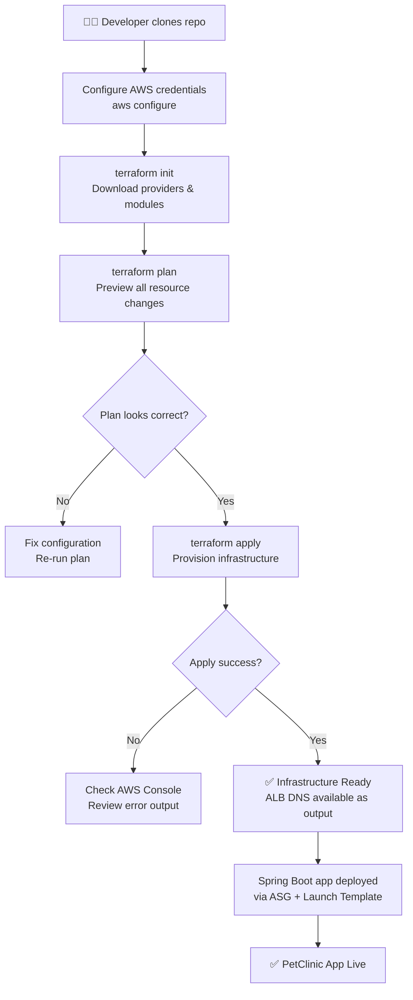
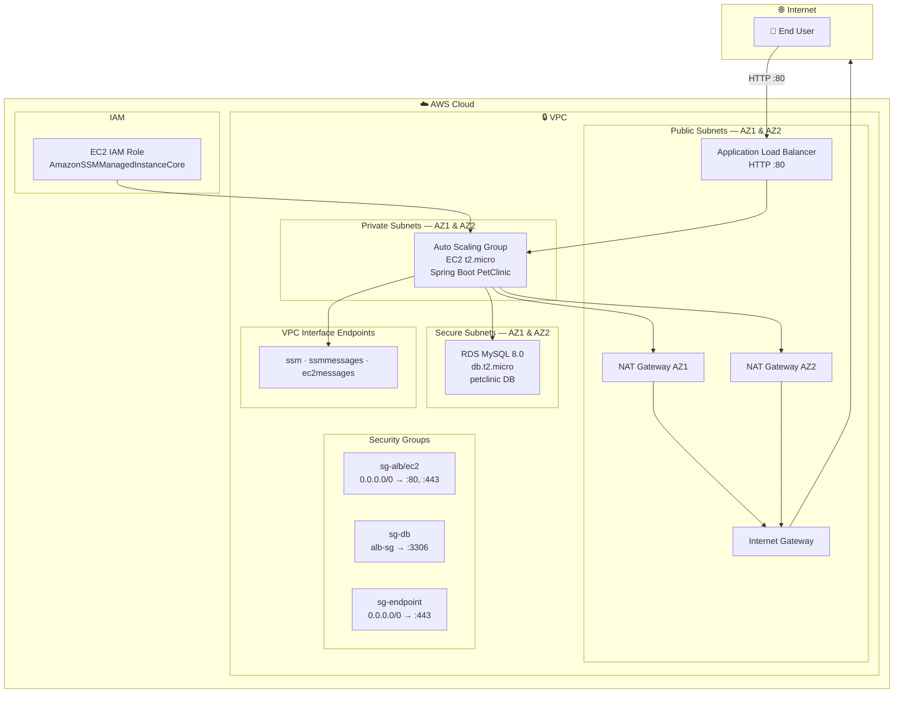
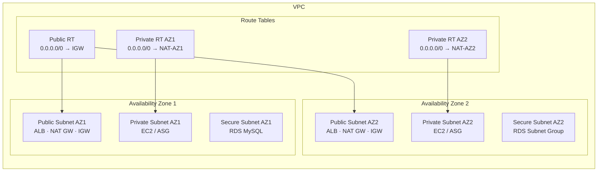
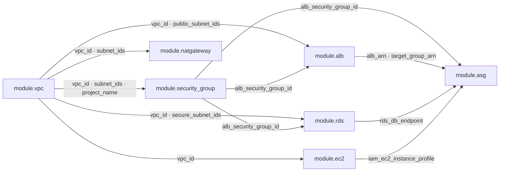
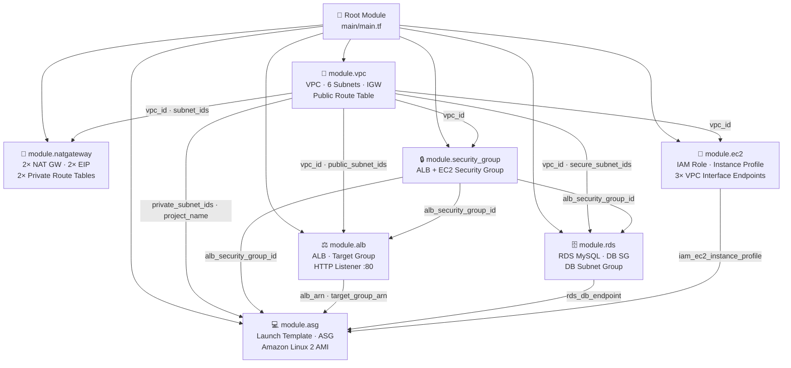

# 🏗️ Terraform Infrastructure — Spring Boot Application on AWS

> **Infrastructure as Code (IaC)** solution to provision and deploy a Spring Boot (PetClinic) application on AWS using Terraform — fully automated, parameterized, and production-ready.

---

## 📋 Table of Contents

- [How to Deploy](#-how-to-deploy)
- [Deployment Workflow](#-deployment-workflow)
- [Architecture Overview](#-architecture-overview)
- [Infrastructure Components](#-infrastructure-components)
- [Project Structure](#-project-structure)
- [Key Engineering Techniques](#-key-engineering-techniques)
  - [Modular Design](#1-modular-design)
  - [locals + for_each for Dynamic Resource Creation](#2-locals--for_each-for-dynamic-resource-creation)
  - [Data Sources for Dynamic Parameterization](#3-data-sources-for-dynamic-parameterization)
  - [templatefile() for Dynamic User Data](#4-templatefile-for-dynamic-user-data)
  - [Advanced Networking — Three-Tier VPC](#5-advanced-networking--three-tier-vpc)
  - [Per-AZ NAT Gateway Design](#6-per-az-nat-gateway-design)
  - [IAM + SSM — No SSH Required](#7-iam--ssm--no-ssh-required)
  - [Cross-Module Output Passing](#8-cross-module-output-passing)
  - [lifecycle — create_before_destroy](#9-lifecycle--create_before_destroy)
- [Module Dependency Graph](#-module-dependency-graph)
- [Interviewer Highlights](#-interviewer-highlights)

---
## How to Deploy

### Prerequisites

- Terraform `>= 1.0`
- AWS CLI configured (`aws configure`)
- IAM permissions for EC2, VPC, RDS, IAM, ALB

### Steps

```bash
# 1. Clone the repository
git clone https://github.com/mavikcodes/Terraform_Infra_SpringApp.git
cd Terraform_Infra_SpringApp/main

# 2. Initialise — downloads the AWS provider
terraform init

# 3. Preview what will be created
terraform plan

# 4. Apply — provisions all infrastructure (~5-10 mins)
terraform apply

# 5. Retrieve the ALB DNS to access the app
terraform output
```

### Tear Down

```bash
terraform destroy
```

---
## 🚀 Deployment Workflow



---

## 🏛️ Architecture Overview

The solution provisions a **three-tier, multi-AZ** infrastructure for a Spring Boot (PetClinic) application. Traffic enters through a public-facing Application Load Balancer, reaches EC2 instances managed by an Auto Scaling Group in private subnets, which connect to a MySQL RDS instance in isolated secure subnets.



---

## 🧩 Infrastructure Components

| Component | AWS Resource | Module | Details |
|---|---|---|---|
| **Network** | VPC, Subnets, IGW, Route Tables | `vpc` | 3 tiers: public / private / secure across 2 AZs |
| **NAT** | NAT Gateway, Elastic IP | `natgateway` | One NAT Gateway per AZ with dedicated route tables |
| **Security** | Security Groups | `security_group` | HTTP :80 and HTTPS :443 from internet |
| **Load Balancer** | ALB, Target Group, Listener | `alb` | HTTP :80 → forward to EC2 target group |
| **Compute & IAM** | IAM Role, VPC Endpoints, Instance Profile | `ec2` | SSM-managed access; no SSH; 3 Interface Endpoints |
| **App Scaling** | Launch Template, ASG | `asg` | Latest Amazon Linux 2 AMI; userdata via templatefile |
| **Database** | RDS MySQL, DB Subnet Group, DB SG | `rds` | MySQL 8.0.31, single-AZ, isolated in secure subnets |

---

## 📁 Project Structure

```
Terraform_Infra_SpringApp/
│
├── main/
│   ├── main.tf           # Root module — orchestrates all child modules
│   ├── variables.tf      # Input variable declarations
│   ├── outputs.tf        # Exposed outputs (ALB DNS, etc.)
│   └── userdata.sh       # EC2 bootstrap script (rendered via templatefile)
│
└── modules/
    ├── vpc/              # VPC, 6 Subnets (public/private/secure), IGW, Route Tables
    │   ├── main.tf
    │   ├── variables.tf
    │   └── outputs.tf
    │
    ├── natgateway/       # Elastic IPs, NAT Gateways (per AZ), Private Route Tables
    │   ├── main.tf
    │   ├── variables.tf
    │   └── outputs.tf
    │
    ├── security_group/   # Shared ALB/EC2 Security Group
    │   ├── main.tf
    │   ├── variables.tf
    │   └── outputs.tf
    │
    ├── alb/              # ALB, Target Group, HTTP Listener
    │   ├── main.tf
    │   ├── variables.tf
    │   └── outputs.tf
    │
    ├── ec2/              # VPC Interface Endpoints (SSM), IAM Role + Instance Profile
    │   ├── main.tf
    │   ├── variables.tf
    │   └── outputs.tf
    │
    ├── asg/              # AMI Data Source, Launch Template, Auto Scaling Group
    │   ├── main.tf
    │   ├── variables.tf
    │   └── outputs.tf
    │
    └── rds/              # DB Security Group, DB Subnet Group, RDS MySQL Instance
        ├── main.tf
        ├── variables.tf
        └── outputs.tf
```

---

## 🔑 Key Engineering Techniques

### 1. Modular Design

The root `main/main.tf` acts purely as an **orchestrator** — it contains zero resource definitions. Every piece of infrastructure lives in a dedicated child module with its own `variables.tf` and `outputs.tf`. The root module wires them together by passing outputs from one module as inputs to the next.

```hcl
# main/main.tf

module "vpc" {
  source                  = "../modules/vpc"
  region                  = var.region
  project_name            = var.project_name
  vpc_cidr                = var.vpc_cidr
  public_subnet_az1_cidr  = var.public_subnet_az1_cidr
  public_subnet_az2_cidr  = var.public_subnet_az2_cidr
  private_subnet_az1_cidr = var.private_subnet_az1_cidr
  private_subnet_az2_cidr = var.private_subnet_az2_cidr
  secure_subnet_az1_cidr  = var.secure_subnet_az1_cidr
  secure_subnet_az2_cidr  = var.secure_subnet_az2_cidr
}

module "asg" {
  source                    = "../modules/asg"
  project_name              = module.vpc.project_name
  rds_db_endpoint           = module.rds.rds_db_endpoint
  private_subnet_az1_id     = module.vpc.private_subnet_az1_id
  private_subnet_az2_id     = module.vpc.private_subnet_az2_id
  application_load_balancer = module.application_load_balancer.application_load_balancer
  alb_target_group_arn      = module.application_load_balancer.alb_target_group_arn
  alb_security_group_id     = module.security_group.alb_security_group_id
  iam_ec2_instance_profile  = module.ec2.iam_ec2_instance_profile
}
```

---

### 2. `locals` + `for_each` for Dynamic Resource Creation

Instead of writing a separate `aws_vpc_endpoint` resource block for each SSM endpoint, the `ec2` module uses a **`locals` map** combined with **`for_each`** to create all three VPC Interface Endpoints from a single resource block. Adding or removing an endpoint is a one-line change to the map.

```hcl
# modules/ec2/main.tf

locals {
  endpoints = {
    "endpoint-ssm" = {
      name = "ssm"
    },
    "endpoint-ssmmessages" = {
      name = "ssmmessages"
    },
    "endpoint-ec2-messages" = {
      name = "ec2messages"
    }
  }
}

resource "aws_vpc_endpoint" "endpoints" {
  vpc_id             = var.vpc_id
  for_each           = local.endpoints
  vpc_endpoint_type  = "Interface"
  service_name       = "com.amazonaws.${var.region}.${each.value.name}"
  security_group_ids = [aws_security_group.vpc_endpoint_security_group.id]
}
```

This creates three uniquely keyed resources — removing one entry from the map only destroys that specific endpoint, leaving the others untouched.

---

### 3. Data Sources for Dynamic Parameterization

Two data sources make the configuration fully environment-agnostic — no hardcoded AZ names or AMI IDs anywhere in the codebase.

**`aws_availability_zones`** — used in both the `vpc` and `rds` modules to automatically discover AZs in whichever region Terraform targets:

```hcl
# modules/vpc/main.tf

data "aws_availability_zones" "available_zones" {}

resource "aws_subnet" "public_subnet_az1" {
  vpc_id            = aws_vpc.infra.id
  cidr_block        = var.public_subnet_az1_cidr
  availability_zone = data.aws_availability_zones.available_zones.names[0]
  map_public_ip_on_launch = true
  tags = {
    Name = "public subnet az1"
  }
}
```

**`aws_ami` with `filter` blocks** — used in the `asg` module to always resolve the latest Amazon Linux 2 AMI at plan time:

```hcl
# modules/asg/main.tf

data "aws_ami" "amazon_linux_2" {
  most_recent = true
  owners      = ["amazon"]

  filter {
    name   = "owner-alias"
    values = ["amazon"]
  }

  filter {
    name   = "name"
    values = ["amzn2-ami-hvm*"]
  }
}
```

No AMI ID ever needs to be manually updated — Terraform resolves the freshest one on every `plan`.

---

### 4. `templatefile()` for Dynamic User Data

The EC2 Launch Template injects the live RDS endpoint into the EC2 bootstrap script at apply time using `templatefile()`, combined with `base64encode()` as required by the Launch Template API. No database URLs are hardcoded anywhere.

```hcl
# modules/asg/main.tf

resource "aws_launch_template" "ec2_asg" {
  name          = "my-launch-template"
  image_id      = data.aws_ami.amazon_linux_2.id
  instance_type = "t2.micro"

  iam_instance_profile {
    name = var.iam_ec2_instance_profile.name
  }

  user_data = base64encode(
    templatefile("userdata.sh", { mysql_url = var.rds_db_endpoint })
  )

  vpc_security_group_ids = [var.alb_security_group_id]

  lifecycle {
    create_before_destroy = true
  }
}
```

The `userdata.sh` script receives `mysql_url` as a template variable and uses it to configure the Spring Boot application's database connection — the RDS endpoint flows automatically from the `rds` module output into the running EC2 instance at boot.

---

### 5. Advanced Networking — Three-Tier VPC

The VPC is split into **three distinct subnet tiers**, each with its own route table and security group controls, enforcing strict traffic isolation between the public, application, and database layers.



| Tier | Subnets | Route | Accessible From |
|---|---|---|---|
| **Public** | `public_subnet_az1/2` | `0.0.0.0/0 → IGW` | Internet (ALB, NAT GW) |
| **Private** | `private_subnet_az1/2` | `0.0.0.0/0 → NAT GW` | ALB only (via SG) |
| **Secure** | `secure_subnet_az1/2` | No internet route | App layer only (port 3306 via DB SG) |

The secure subnets have no route table entry to the internet — the RDS instance cannot initiate or receive internet connections at the network layer.

---

### 6. Per-AZ NAT Gateway Design

Two separate NAT Gateways are provisioned — one per AZ — each with its own Elastic IP and a dedicated private route table:

```hcl
# modules/natgateway/main.tf

resource "aws_nat_gateway" "nat_gateway_az1" {
  allocation_id = aws_eip.eip_for_nat_gateway_az1.id
  subnet_id     = var.public_subnet_az1_id
  depends_on    = [var.internet_gateway]
}

resource "aws_nat_gateway" "nat_gateway_az2" {
  allocation_id = aws_eip.eip_for_nat_gateway_az2.id
  subnet_id     = var.public_subnet_az2_id
  depends_on    = [var.internet_gateway]
}

resource "aws_route_table" "private_route_table_az1" {
  vpc_id = var.vpc_id
  route {
    cidr_block     = "0.0.0.0/0"
    nat_gateway_id = aws_nat_gateway.nat_gateway_az1.id
  }
}

resource "aws_route_table" "private_route_table_az2" {
  vpc_id = var.vpc_id
  route {
    cidr_block     = "0.0.0.0/0"
    nat_gateway_id = aws_nat_gateway.nat_gateway_az2.id
  }
}
```

A shared single NAT Gateway would be a **single point of failure** — if its AZ went down, all private subnets would lose outbound internet. The per-AZ design also eliminates cross-AZ data transfer charges.

---

### 7. IAM + SSM — No SSH Required

EC2 instances have no key pair. Access is managed entirely through **IAM roles and AWS Systems Manager**. The `ec2` module creates the role, attaches `AmazonSSMManagedInstanceCore`, and provisions three VPC Interface Endpoints so SSM traffic never leaves the VPC. The IAM trust policy is authored inline using `jsonencode()`:

```hcl
# modules/ec2/main.tf

resource "aws_iam_role" "ec2_role" {
  name = "EC2_SSM_Role"
  assume_role_policy = jsonencode({
    Version = "2012-10-17"
    Statement = [{
      Effect    = "Allow"
      Principal = { Service = "ec2.amazonaws.com" }
      Action    = "sts:AssumeRole"
    }]
  })
}

resource "aws_iam_role_policy_attachment" "ec2_role_policy" {
  policy_arn = "arn:aws:iam::aws:policy/AmazonSSMManagedInstanceCore"
  role       = aws_iam_role.ec2_role.name
}

resource "aws_iam_instance_profile" "ec2_instance_profile" {
  name = "EC2_SSM_Instance_Profile"
  role = aws_iam_role.ec2_role.name
}
```

---

### 8. Cross-Module Output Passing

No resource ID is ever hardcoded between modules. Every value — `vpc_id`, `subnet_ids`, `alb_security_group_id`, `rds_db_endpoint`, `iam_ec2_instance_profile` — flows through declared outputs and inputs, maintaining clean module boundaries.



---

### 9. `lifecycle` — `create_before_destroy`

Both the ALB Target Group and the EC2 Launch Template use `create_before_destroy = true`, so Terraform creates the replacement resource first before destroying the old one — preventing traffic gaps during updates:

```hcl
# modules/alb/main.tf
resource "aws_lb_target_group" "alb_target_group" {
  ...
  lifecycle {
    create_before_destroy = true
  }
}

# modules/asg/main.tf
resource "aws_launch_template" "ec2_asg" {
  ...
  lifecycle {
    create_before_destroy = true
  }
}
```

---

## 🔗 Module Dependency Graph



---


## 🏆 Techniques Used

> Specific engineering decisions in this codebase that demonstrate Terraform and DevOps maturity.

### ✅ Clean Modular Architecture
Seven focused child modules, each with a single responsibility. The root module holds zero `resource` blocks — only `module` calls. This mirrors how platform engineering teams structure shared infrastructure at scale.

### ✅ Dynamic Data Sources — No Hardcoded AZ Names or AMI IDs
`aws_availability_zones` makes the config portable across any AWS region. `aws_ami` with `filter` blocks always resolves the latest Amazon Linux 2 AMI at plan time — no manual updates ever needed.

### ✅ `templatefile()` — Runtime Config Injection
The RDS endpoint is injected into the EC2 boot script automatically at `terraform apply` time. No connection strings are hardcoded anywhere — the value flows from the RDS module output through `templatefile()` into the running instance.

### ✅ Per-AZ NAT Gateway — High Availability Design
Separate NAT Gateways in each AZ with dedicated private route tables eliminate the cross-AZ single point of failure and cross-AZ data transfer costs.

### ✅ IAM + SSM — Zero SSH Attack Surface
No keypairs, no bastion hosts. EC2 access is exclusively via AWS Systems Manager Session Manager, backed by a minimal IAM instance profile. Three VPC Interface Endpoints keep SSM traffic inside the VPC.

### ✅ `jsonencode()` for Inline IAM Policies
IAM trust policies are authored directly in HCL using `jsonencode()` — no separate `.json` files, fully version-controlled and diff-friendly alongside the infrastructure code.

### ✅ `lifecycle { create_before_destroy }` — Zero-Downtime Updates
The ALB Target Group and Launch Template both use `create_before_destroy = true`, ensuring Terraform never tears down an existing resource before its replacement is ready.

### ✅ Explicit `depends_on` for Correct Provisioning Order
NAT Gateways declare `depends_on = [var.internet_gateway]` and the ASG declares `depends_on = [var.application_load_balancer]` — making implicit infrastructure ordering explicit and preventing race conditions during apply.

### ✅ Clean Cross-Module Output Wiring
No resource ID is ever hardcoded across module boundaries. Every value flows through declared `outputs.tf` → `variables.tf` contracts, keeping modules independently testable and reusable.

---

<div align="center">
  <sub>Built using Terraform · AWS · Infrastructure as Code best practices</sub>
</div>
